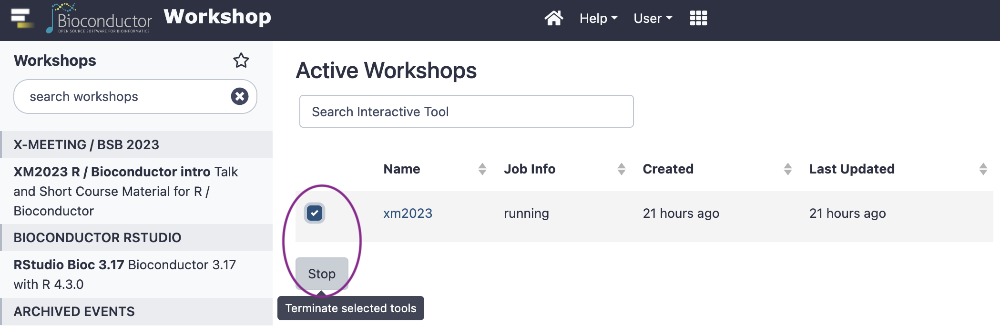

# Executando análise de expressão com métodos paramétricos

Vamos utilizar o método paramétrico [edgeR](https://bioconductor.org/packages/release/bioc/html/edgeR.html).

Você pode carregar o pacote consexpressionR para usar o conjunto de dados disponível nele. Ou pode baixar o RData [AQUI](https://github.com/costasilvati/consexpressionR/blob/master/data/gse95077.rda).


<!-- ## Os passos da análise -->


<!--      -->


## Introdução

A análise de expressão diferencial de genes com dados de RNA-Seq utilizando o pacote R **edgeR** envolve várias etapas. Vejamos os passos principais e alguns dos parâmetros utilizados.

## Passos para Análise de Expressão Diferencial com edgeR

### Instalação e Carregamento do edgeR

```r
install.packages("BiocManager")
BiocManager::install("edgeR")
library(edgeR)
```

### Importação e Preparação dos Dados

- **Leitura dos dados**: Importar os dados de contagem de RNA-Seq.
- **Criação do objeto DGEList**: Este objeto armazena as contagens de genes e as informações de grupo.

```{r, include = FALSE}
library(consexpressionR)
library(edgeR)
# Para arquivos de texto
# counts <- read.table("counts.txt", header=TRUE, row.names=1)

# dataset gse95077 contem 3 amostras de BM e 3 de JJ
design <- rep(c("BM","JJ"), each = 3)
#cria objeto edgeR
y <- DGEList(counts = gse95077, group = design)

```
<!--
```{r}
y.dge <- calcNormFactors(y.dge, method="TMM")
y.dge <- estimateDisp(y.dge)
y.dge <- estimateCommonDisp(y.dge)
y.et <- exactTest(y.dge)
y.tp <- topTags(y.et, n = 100000)
y.pvalues <- y.et$table$PValue
```
-->
### Filtragem de Baixa Expressão

- Remover genes com baixa contagem para reduzir o ruído.

```{r}
keep <- filterByExpr(y) # TRUE ou FALSE
y <- y[keep, , keep.lib.sizes=FALSE]
```

### Normalização dos Dados

- Normalizar as contagens para ajustar as diferenças na profundidade de sequenciamento.

```r
y <- calcNormFactors(y)
```

### Estimativa da Dispersão

- Estimar a dispersão comum, trended e tagwise.

```r
y <- estimateDisp(y)
```

### Teste de Expressão Diferencial

- Utilizar o teste exato de Fisher modificado para dados de contagem.

```r
et <- exactTest(y)
```

### Resultados

- Extrair os resultados e visualizar os genes diferencialmente expressos.

```r
topTags(et)
```

## Parâmetros Utilizados

- **DGEList**: Cria um objeto que contém as contagens de genes e as informações de grupo.
- **filterByExpr**: Filtra genes com baixa expressão para melhorar a precisão da análise.
- **calcNormFactors**: Calcula fatores de normalização para ajustar as diferenças na profundidade de sequenciamento.
- **estimateDisp**: Estima a dispersão dos dados, essencial para modelar a variabilidade biológica.
- **exactTest**: Realiza o teste exato de Fisher modificado para identificar genes diferencialmente expressos.
```

Espero que isso ajude! Se precisar de mais alguma coisa, é só avisar.
